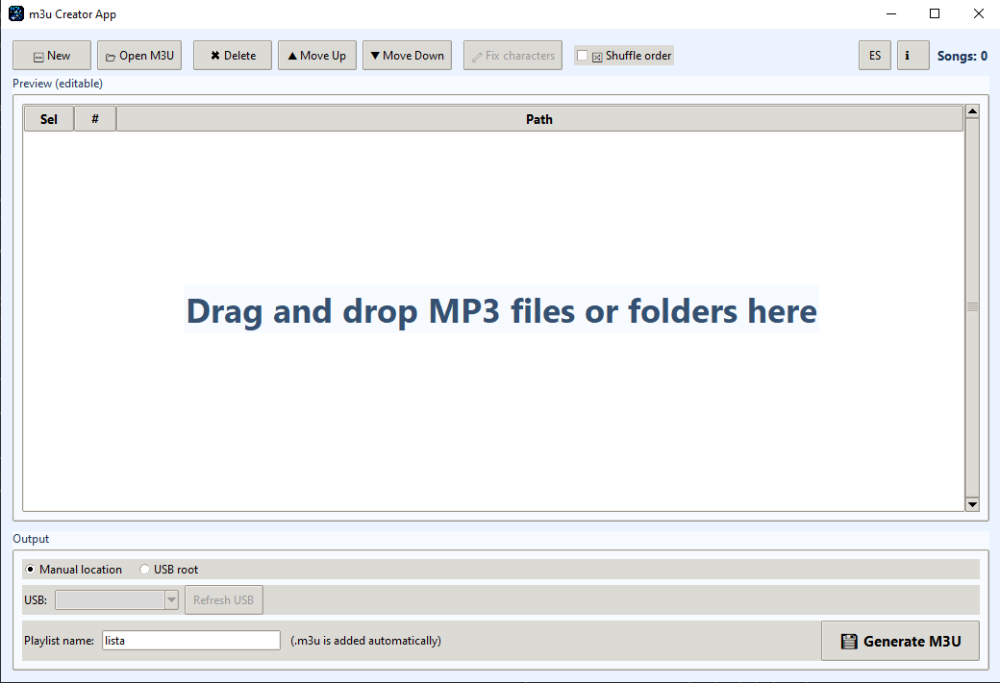

# M3U Creator App

[](LICENSE)
[](https://www.python.org/downloads/)
[](https://github.com/inputgain/m3u_creator_APP/releases)
[](https://ko-fi.com/L3L11XAA7Y)

Desktop app in Python to build `.m3u` playlists from drag-and-drop files/folders.



## Features

- Drag and drop files or folders.
- Recursive `.mp3` scan when a folder is dropped.
- Real-time editable preview list.
- Reorder items:
  - Drag-and-drop inside list with visual row highlight.
  - Move up/down buttons.
- Remove selected items.
- Toggle random order on/off.
- Larger drop zone integrated into preview area.
- Icon-labeled action buttons for quicker recognition.
- Save mode:
  - Manual location (file dialog).
  - USB root (auto-detected removable drives).
- Output with UTF-8 and overwrite confirmation.
- Load existing M3U files — open, parse, detect missing tracks with confirmation dialog, default to overwrite original on save.
- USB auto-detection on both Windows (drive letters) and Linux (`/media/$USER`, `/run/media/$USER`, `/mnt`).
- Non-ASCII character detection with visual highlighting, auto-fix, and on-disk rename.
- Bilingual interface (ES/EN) with language toggle button.

## Install

```powershell
python -m pip install -r requirements.txt
```

## Run

```powershell
python app.py
```

## Build Executable

```powershell
py build.py
```

The script reads the version from `app.py` and generates the .exe with embedded version info.

Output: `dist\M3U Creator App v{version}.exe`

## Notes

- The app currently includes only `.mp3` files.
- Playlist lines are normalized with `/`.
- If a track is outside the target `.m3u` directory tree, the app writes a path rooted from the drive root (without drive letter), to keep portable-style output.

## Contributing

Contributions are welcome! Feel free to open issues or submit pull requests.

See [CONTRIBUTING.md](CONTRIBUTING.md) for development setup and build instructions.

## License

This project is licensed under the MIT License — see the [LICENSE](LICENSE) file for details.

## Disclaimer

This software is provided "as is", without warranty of any kind. Use it at your own risk. The author is not responsible for any damage or data loss that may result from using this application.
